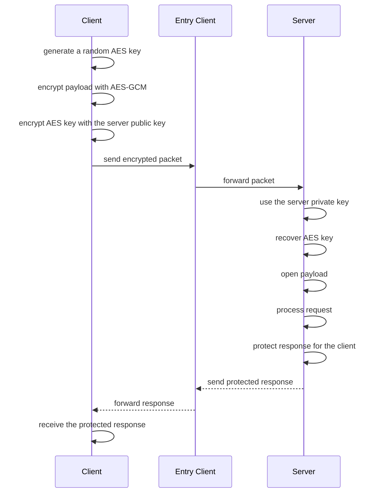
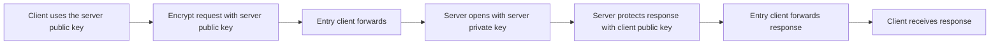

# Public And Private Key Model

This document explains the public/private key model used by GhostMesh in the hidden-service flow.

## Overview

In the current model:

* the client uses the server public key to encrypt the request
* the server uses its private key to open the request
* the server uses the client public key to protect the response
* the client example in this documentation does not expose its own private key

This creates an application-level protected channel even when the message passes through intermediate peers.

## Optional Server Reveal

By default, a hidden-service server does not identify itself to probes.

If the server enables:

```ts
server.setOptions({
  identity: {
    role: 'master',
    privateKey: SERVER_PRIVATE_KEY_PEM
  },
  hiddenService: {
    role: 'master',
    serviceName: 'directory',
    revealServer: true
  }
})
```

another peer can check:

```ts
const revealed = await peer.isServer()
console.log(revealed)
```

This does not rely on a plain boolean flag alone. The peer only returns `true` when the remote side proves possession of the private key that matches the configured server public key.

## Minimal Example

Server:

```ts
import GhostMesh from 'ghostmesh'

const server = new GhostMesh(['wss://tracker.openwebtorrent.com'], 'my-app')

server.setOptions({
  identity: {
    role: 'master',
    privateKey: SERVER_PRIVATE_KEY_PEM
  },
  hiddenService: {
    role: 'master',
    serviceName: 'directory',
    fixedPacketBytes: 4096
  }
})

server.handleHiddenService('directory', async (payload) => {
  return {
    ok: true,
    received: payload
  }
})

await server.start()
```

Client:

```ts
import GhostMesh from 'ghostmesh'

const client = new GhostMesh(['wss://tracker.openwebtorrent.com'], 'my-app')

client.setOptions({
  identity: {
    role: 'client',
    publicKey: CLIENT_PUBLIC_KEY_PEM
  },
  hiddenService: {
    serviceName: 'directory',
    entryPeers: ['entry-peer-id'],
    masterPeerId: 'server-peer-id',
    masterPublicKey: SERVER_PUBLIC_KEY_PEM,
    fixedPacketBytes: 4096
  }
})

await client.start()

const response = await client.requestHiddenService('directory', {
  action: 'lookup',
  username: 'alice'
}, {
  entryPeerId: 'entry-peer-id',
  masterPublicKey: SERVER_PUBLIC_KEY_PEM
})

console.log(response)
```

## Participants

There are three logical roles in the flow:

* `Requesting client`
* `Entry client`
* `Central server`

In the demo, every client can also act as an entry point.

## Full Flow



## Request: client to server

### What the client needs

To send a protected request to the server, the client needs:

* the server public key
* the client public key
* an entry peer
* the service name

### What happens

1. The client creates a temporary symmetric key.
2. The payload is encrypted with `AES-GCM`.
3. The symmetric key is encrypted with `RSA-OAEP` using the server public key.
4. The packet moves through the mesh until it reaches the server.

### Security consequence

* the intermediate peer cannot read the content
* only the server with the correct private key can read the request

Usage snippet:

```ts
client.setOptions({
  hiddenService: {
    serviceName: 'directory',
    entryPeers: ['entry-peer-id'],
    masterPublicKey: SERVER_PUBLIC_KEY_PEM
  }
})

const response = await client.requestHiddenService('directory', {
  action: 'lookup'
})
```

## Response: server to client

### What the server uses

The server receives the client public key in the request.

With that, it:

1. generates a new symmetric key for the response
2. encrypts the response body with `AES-GCM`
3. encrypts the symmetric key with the client public key
4. sends the packet back through the response path

### Security consequence

* only the requesting client can consume the intended response

Usage snippet:

```ts
server.handleHiddenService('directory', async (payload) => {
  return {
    ok: true,
    data: payload
  }
})
```

## What each key does

### Server public key

Used to:

* encrypt requests sent to the server

Not used to:

* decrypt requests

### Server private key

Used to:

* decrypt requests sent to the server

It should:

* stay only on the server

### Client public key

Used to:

* identify the public key used in the response flow

In this project's documentation:

* the visible client example does not carry its own private key

## What the intermediate peer can see

The entry client can still observe:

* that traffic forwarding happened
* which peers are involved in the local hop
* approximate traffic volume and timing

But it cannot read:

* the encrypted request body
* the encrypted response body

## What is protected

* payload confidentiality
* response confidentiality
* separation between forwarding and content readability

## What is not fully protected

* network metadata
* communication patterns between peers
* strong anonymity

This model improves payload privacy, but it is not a replacement for a strong anonymity network.

## Quick Mental Map



## Relation To The Demo

In the demo:

* `client` shows the public key
* `server` shows the private key
* the request uses the server public key
* the response comes back protected for the client

How to test in the demo:

1. Open two or three tabs with the same identifier.
2. In one tab, choose `server` and load `Load server keys`.
3. In another tab, choose `client` and load `Load client keys`.
4. On the client, select one peer as `entry client`.
5. On the client, select the server peer as `master`.
6. Click `Apply role` in each tab.
7. On the client, click `Request service`.

## Summary

In one sentence:

* a public key encrypts data for the owner of the matching private key

In the GhostMesh flow:

* client -> uses the server public key
* server -> uses the server private key
* server -> uses the client public key to protect the response
