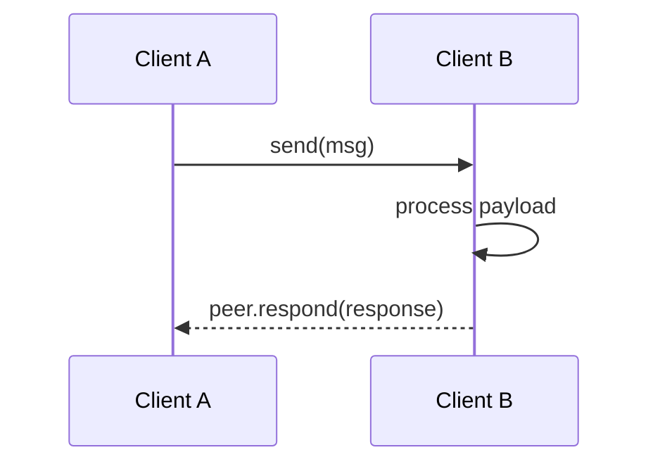
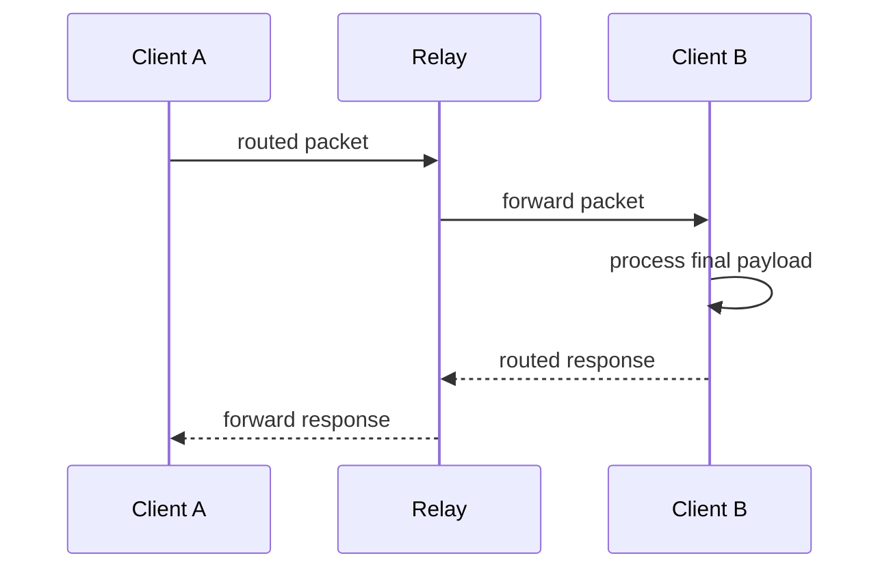
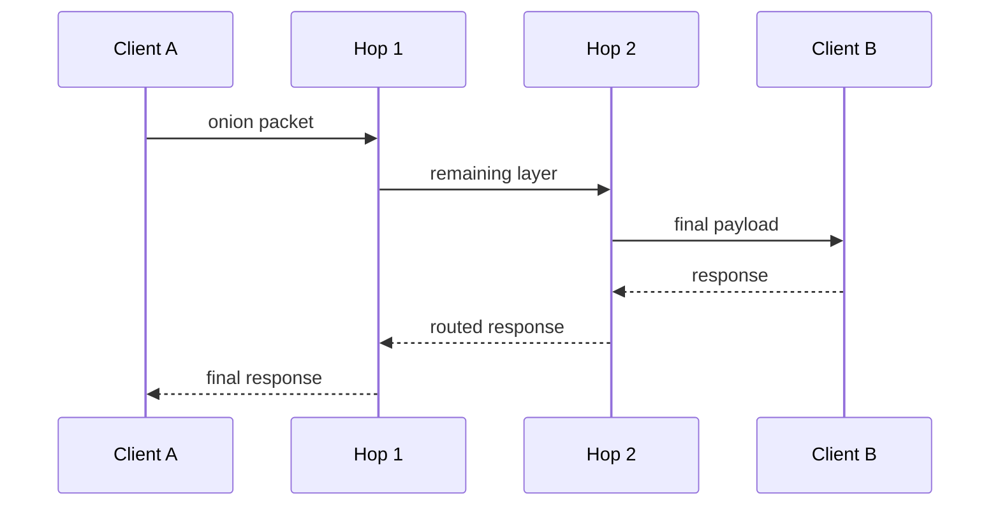
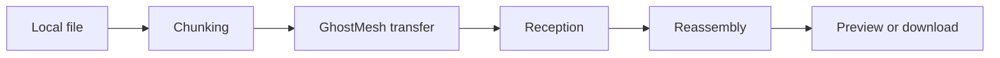
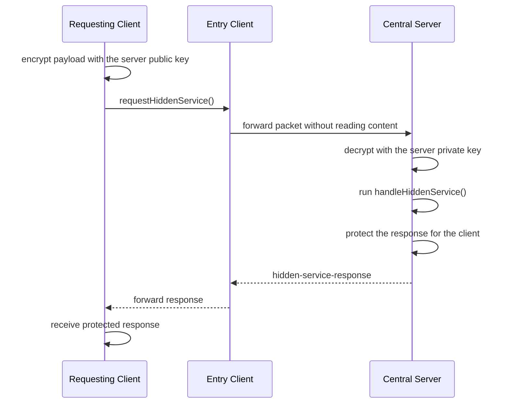
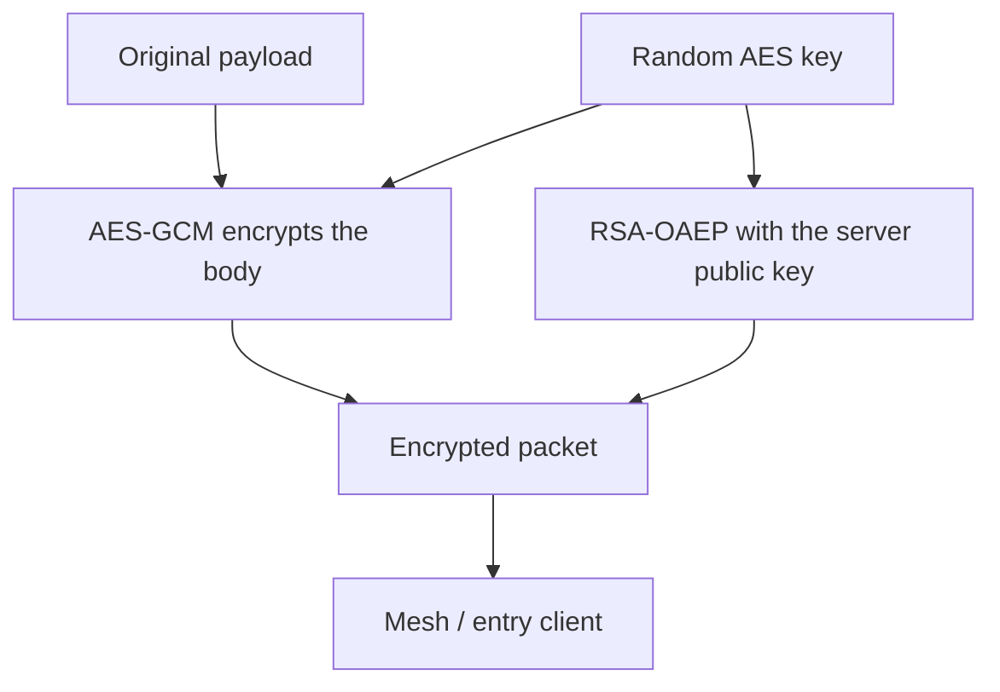
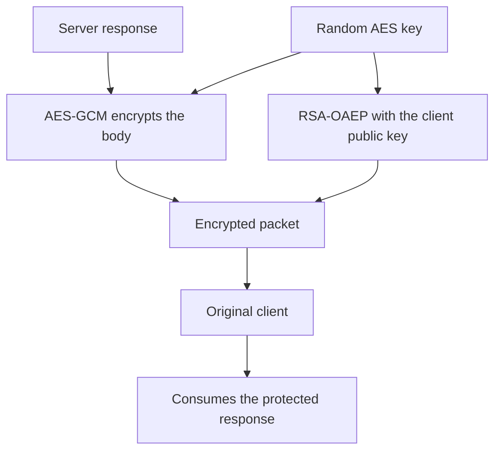
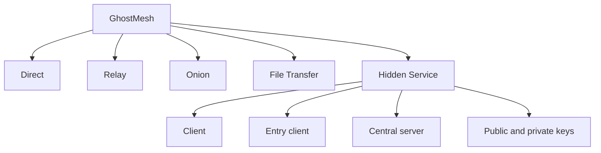

# GhostMesh Network Models

This file summarizes the communication models used by the project and the demo.

## 1. Direct Message

Basic flow between two connected peers.



Notes:

* Lowest latency.
* The destination peer knows who sent the message.
* No extra obfuscation layer.

How to use:

```ts
import GhostMesh from 'ghostmesh'

const gmesh = new GhostMesh(['wss://tracker.openwebtorrent.com'], 'my-app')

gmesh.on('msg', async (peer, msg) => {
  console.log('received', msg)
  await peer.respond({ ok: true })
})

await gmesh.start()

const peer = Object.values((await gmesh.requestMorePeers())['peer-id'] ?? {})[0]
if (peer) {
  const [, response] = await gmesh.send(peer, {
    type: 'direct',
    text: 'hello'
  })

  console.log(response)
}
```

## 2. Relay Message

An intermediate peer forwards the message to the destination.



Notes:

* The relay knows it forwarded traffic between two sides.
* The relay is not the final destination.
* The path is more flexible than direct delivery.

How to use:

```ts
gmesh.setOptions({
  onion: {
    through: ['relay-peer-id']
  }
})

const [peer, response] = await gmesh.send(targetPeer, {
  type: 'relay',
  text: 'message going through a relay'
})

console.log(peer.id, response)
```

## 3. Onion / Multi-hop

The payload passes through multiple peers before reaching the destination.



Notes:

* Each hop only knows the next step in the route.
* This reduces direct exposure, but it does not provide strong anonymity.
* The project treats this as lightweight obfuscation, not Tor-like privacy.

How to use:

```ts
gmesh.setOptions({
  onion: {
    hops: 2
  }
})

const [peer, response] = await gmesh.send(targetPeer, {
  type: 'onion',
  text: 'message with random hops'
})

console.log(peer.routeInfo, response)
```

## 4. File Transfer

Files follow the currently active delivery strategy.



Notes:

* The file is split into chunks.
* `FileSession` tracks progress, pause, cancel, and completion.
* Videos and images can receive progressive previews in the demo.

How to use:

```ts
const session = await gmesh.sendFile(targetPeer, file, {
  chunkSize: 12 * 1024,
  metadata: {
    purpose: 'demo'
  }
})

session.on('progress', current => {
  console.log(current.receivedBytes, current.size)
})

session.on('complete', current => {
  console.log('file sent', current.transferId)
})
```

Receiving:

```ts
gmesh.on('file', async (peer, session) => {
  console.log('incoming file from', peer.id, session.name)

  session.on('complete', async current => {
    const blob = await current.blob()
    console.log('download ready', blob.size)
  })
})
```

## 5. Hidden Service / Central Server

Model used in the demo with a client and a central server.



Notes:

* Any client can also act as an entry point.
* The intermediate peer forwards the packet but cannot open the encrypted body.
* The central server needs the correct private key to read the request.
* A server only reveals its identity to probes when `revealServer` is explicitly enabled.

How to use on the server:

```ts
gmesh.setOptions({
  identity: {
    role: 'master',
    privateKey: SERVER_PRIVATE_KEY_PEM
  },
  hiddenService: {
    role: 'master',
    serviceName: 'directory',
    revealServer: true,
    fixedPacketBytes: 4096
  }
})

gmesh.handleHiddenService('directory', async (payload, context) => {
  console.log('hidden request', context.requestId, payload)

  return {
    ok: true,
    payload
  }
})
```

How to use on the client:

```ts
gmesh.setOptions({
  identity: {
    role: 'client',
    publicKey: CLIENT_PUBLIC_KEY_PEM
  },
  hiddenService: {
    serviceName: 'directory',
    entryPeers: ['entry-peer-id'],
    masterPeerId: 'server-peer-id',
    masterPublicKey: SERVER_PUBLIC_KEY_PEM,
    fixedPacketBytes: 4096
  }
})

const response = await gmesh.requestHiddenService('directory', {
  action: 'lookup',
  username: 'alice'
}, {
  entryPeerId: 'entry-peer-id',
  masterPublicKey: SERVER_PUBLIC_KEY_PEM
})

console.log(response)
```

How to detect whether a peer is the revealed server:

```ts
gmesh.setOptions({
  hiddenService: {
    masterPublicKey: SERVER_PUBLIC_KEY_PEM
  }
})

const revealed = await peer.isServer()
console.log(revealed)
```

## 6. Keys and Security

The project uses hybrid encryption:

* RSA-OAEP protects the symmetric key.
* AES-GCM protects the payload body.

### 6.1 Client request to the server



Result:

* Only the server with the matching private key can open the AES key.
* The intermediate peer can see the packet, but not the useful content.

Matching snippet:

```ts
const response = await gmesh.requestHiddenService('directory', {
  action: 'lookup',
  username: 'alice'
}, {
  entryPeerId: 'entry-peer-id',
  masterPublicKey: SERVER_PUBLIC_KEY_PEM
})
```

### 6.2 Server response to the client



Result:

* Only the requesting client can consume the intended response for that request flow.

Matching snippet:

```ts
gmesh.handleHiddenService('directory', async (payload) => {
  return {
    ok: true,
    echo: payload
  }
})
```

Note:

* In this documentation, the visible client example does not configure its own private key.
* The visible client example only uses a public key.

## 7. What is protected and what is not

### Protected

* Request content sent to the server.
* Response content returned to the client.
* Payload readability by the intermediate peer.

### Not fully protected

* Network metadata.
* Which peers are connected to each other.
* The fact that one client is forwarding something for another.
* Strong anonymity against path observers.

## 8. Quick map of the models



## 9. Practical summary

* `Direct`: simplest and fastest.
* `Relay`: uses one intermediate peer.
* `Onion`: uses multiple hops.
* `File Transfer`: uses chunks and `FileSession`.
* `Hidden Service`: the client encrypts toward the server, an intermediate peer forwards the packet, and the server sends a protected response back to the client.
